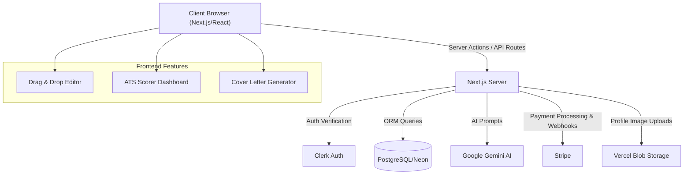

# SparkCV

> AI-powered resume builder, ATS scorer, and cover letter generator — built for job seekers who want to stand out.

[](https://github.com/Sri-dinesh/resume-builder-ai/actions/workflows/ci.yml)
[](https://www.typescriptlang.org/)
[](https://nextjs.org/)
[]()

---

## 1. Project Overview
SparkCV is an intelligent, AI-powered resume builder, ATS (Applicant Tracking System) scorer, and cover letter generator tailored for modern job seekers. It solves the critical problem of generic, poorly formatted, and invisible resumes by providing a streamlined, drag-and-drop interface with integrated Google Gemini-powered enhancements. SparkCV helps candidates craft compelling narratives, optimize for keywords, and ultimately beat automated screening systems to land more interviews.

## 2. Features
- **📝 Intuitive Drag-and-Drop Editor**: Real-time preview and seamless customization of resume sections, enabling users to craft visually appealing documents effortlessly.
- **🤖 AI-Powered Enhancements (Google Gemini)**: One-click resume improvements to optimize phrasing, correct grammar, and highlight achievements for maximum impact.
- **📊 Advanced ATS Scoring System**: Instant resume analysis against target job descriptions, providing keyword gap analysis and actionable recommendations to improve match rates.
- **💌 Tailored Cover Letter Generation**: Automatically generates personalized, highly relevant cover letters based on the user's resume and a specific job posting.
- **📄 Flexible PDF Export**: High-quality, reliable PDF generation ensuring the resume looks identical to the preview and retains ATS readability.
- **💳 Premium Tier Subscriptions (Stripe)**: Tiered access (Free, Pro, Pro Plus) unlocking advanced customization like fonts, color palettes, and custom border styles.
- **🌙 Responsive Dark/Light Mode**: Full theme support for a comfortable user experience regardless of the environment.

## 3. Tech Stack
| Layer | Technology | Role in Project |
| :--- | :--- | :--- |
| **Framework** | Next.js 16 (App Router) | Enables efficient server-side rendering, seamless routing, and optimized performance via Server Actions. |
| **Language** | TypeScript 5.9 | Provides robust type safety, improving code quality, developer experience, and maintainability. |
| **Styling** | Tailwind CSS v4 & Radix UI | Allows for rapid, utility-first styling with accessible, unstyled primitive components for a premium UI. |
| **Database** | PostgreSQL (Neon) & Prisma | Ensures scalable, relational data storage with a type-safe, developer-friendly database ORM client. |
| **Authentication**| Clerk | Manages secure, frictionless user authentication, session handling, and OAuth provider integrations. |
| **Payments** | Stripe | Processes secure subscriptions, webhooks, and handles premium tier provisioning. |
| **AI Integration**| Google Gemini | Powers the core intelligent features like resume text enhancement, ATS analysis, and cover letter generation. |
| **State Mgt** | Zustand | Handles complex, lightweight client-side state management for the drag-and-drop editor. |
| **PDF Generation**| `@react-pdf/renderer` | Generates highly customizable, text-selectable, ATS-friendly PDFs on the client and server. |

## 4. Architecture


## 5. Project Structure
```text
src/
├── app/                  # Next.js App Router (Pages, API routes, Layouts)
│   ├── (main)/           # Authenticated routes (Editor, Resumes, Billing, Cover Letter)
│   └── api/              # Backend REST API endpoints (Webhooks, internal APIs)
├── components/           # Reusable React components
│   ├── resume/           # Core resume preview, PDF rendering, and download logic
│   ├── editor/           # Form inputs, drag-and-drop elements for the builder
│   ├── shared/           # Common UI elements (Buttons, Dialogs, Navbars)
│   └── ui/               # Radix UI primitives wrapped with Tailwind styling
├── lib/                  # Core application logic and utilities
│   ├── ai/               # Google Gemini client setup and prompt definitions
│   ├── billing/          # Stripe integration, subscription tier logic & plans
│   ├── db/               # Prisma client instantiation and database helpers
│   ├── resume/           # Resume data schemas, validation (Zod), scoring algorithms
│   └── utils.ts          # General utility functions (formatting, clsx, tailwind-merge)
└── tests/                # Test suites
    ├── e2e/              # Playwright end-to-end user journey tests
    └── factories/        # Test data factories for unit testing
```

## 6. Installation & Setup

### Prerequisites
- **Node.js**: Version 20+
- **npm**: Version 10+
- **Database**: PostgreSQL (or a [Neon.tech](https://neon.tech) account)
- **External Accounts**: [Clerk](https://clerk.com) (Auth), [Stripe](https://stripe.com) (Payments), [Google AI Studio](https://ai.google.dev/) (Gemini API)

### Local Environment Setup
1. **Clone the repository:**
   ```bash
   git clone https://github.com/Sri-dinesh/resume-builder-ai.git
   cd resume-builder-ai
   ```
2. **Install dependencies:**
   ```bash
   npm install
   ```
3. **Configure environment variables:**
   ```bash
   cp .env.example .env.local
   ```
   *Edit `.env.local` and populate the required keys (Clerk keys, Database URL, Gemini API Key, Stripe secrets).*
4. **Set up the database:**
   ```bash
   npx prisma generate
   npx prisma migrate dev
   ```
5. **Start the development server:**
   ```bash
   npm run dev
   ```
6. *Optional: Run using Docker:*
   ```bash
   docker compose up --build -d
   ```

## 7. Usage
1. **Authentication**: Sign up or log in securely using Clerk via email or social providers.
2. **Create a Resume**: Click "New Resume" on the dashboard to launch the interactive drag-and-drop editor.
3. **Fill & Enhance**: Enter your personal info, experience, education, and skills. Use the "**✨ Enhance with AI**" button on text fields (like summaries or bullet points) to automatically improve the phrasing and impact of your writing.
4. **ATS Check**: Navigate to the "Score" tab. Paste the target job description to get instant feedback, an ATS match score, and missing keywords you should include.
5. **Generate Cover Letter**: Go to the "Cover Letter" section, select your newly created resume, input the job description, and generate a tailored, professional cover letter.
6. **Customize & Export**: Preview the final document, customize colors/fonts (Premium feature), and download as a high-quality, ATS-readable PDF.

## 8. Screenshots / Demo
*(Note: Replace placeholders with actual links/images when deploying)*

- **Live Demo**: [https://sparkcv.vercel.app](https://sparkcv.vercel.app) *(Example Link)*
- **Resume Editor Interface**:  
  ``
- **ATS Scoring Dashboard**:  
  ``
- **AI Cover Letter Generator**:  
  ``

## 9. API Documentation
While the application relies heavily on Next.js Server Actions for internal state mutation (enhancing security and performance), specific external integrations use standard API routes:

- `POST /api/webhooks/stripe`
  - **Purpose**: Handles Stripe subscription updates, checkout session completions, and invoice payments.
  - **Auth**: Requires a valid `Stripe-Signature` header verified against `STRIPE_WEBHOOK_SECRET`.
  - **Response**: `200 OK` on successful processing.
- `POST /api/webhooks/clerk`
  - **Purpose**: Synchronizes user creation, updates, and deletion from Clerk to the local PostgreSQL database.
  - **Auth**: Requires a valid Svix signature header.
  - **Response**: `200 OK` on successful user sync.
- `GET /api/resume/[id]/pdf` *(Internal)*
  - **Purpose**: Generates and streams a PDF version of the specified resume for downloading, ensuring high fidelity.

## 10. Engineering Decisions
- **App Router & Server Actions**: Transitioned to the Next.js 16 App Router to leverage React Server Components for significantly faster page loads and Server Actions for seamless, type-safe data mutations without the overhead of building separate API endpoints.
- **Database (Prisma + Neon)**: Selected Prisma for its excellent developer experience, easy migrations, and strict type safety with TypeScript. Neon provides scalable serverless PostgreSQL, ideal for connection pooling in a serverless Vercel environment.
- **AI Integration (Google Gemini)**: Chose Gemini over OpenAI for its highly competitive pricing, rapid response times for text generation, and excellent reasoning capabilities for complex ATS keyword gap analysis.
- **PDF Generation (`@react-pdf/renderer`)**: Opted for `@react-pdf` over Puppeteer or basic HTML-to-PDF solutions. This ensures consistent, highly customizable, text-selectable, and ATS-friendly PDF generation without the massive infrastructure overhead of headless browsers.
- **State Management (Zustand)**: Used `zustand` for lightweight, scalable client-side state management. This was crucial for handling the complex, nested state of the drag-and-drop resume editor interface performantly.

## 11. Testing
The project employs a robust, multi-layered testing strategy to ensure high reliability and zero regressions.

- **Unit & Integration Tests (Vitest)**: Used to ensure individual utility functions, scoring algorithms, and AI prompt generations work as expected.
- **End-to-End (E2E) Tests (Playwright)**: Simulates real user journeys, including authentication flows, resume creation, drag-and-drop interactions, and PDF downloads.
- **How to run tests**:
  - `npm test` - Runs all unit tests quickly.
  - `npm run test:coverage` - Generates a detailed test coverage report.
  - `npm run test:e2e` - Executes Playwright UI/E2E tests.

## 12. Limitations & Future Improvements
**Current Limitations:**
- **AI Verbosity**: AI enhancements can sometimes be overly verbose; prompt tuning and context window limitations are an ongoing optimization process.
- **Font Support**: PDF export currently supports a limited set of custom fonts due to strict `@react-pdf` font registration constraints and performance overhead.
- **Rate Limiting**: Rate limiting on free tiers is basic (IP-based via Vercel Edge) and could be circumvented.

**Future Improvements:**
- **LinkedIn Integration**: Add functionality to parse and import user profiles directly from LinkedIn URLs or existing PDF resumes to reduce onboarding friction.
- **Template Ecosystem**: Expand the library of professional resume templates catering to specific industries (e.g., Tech, Finance, Creative).
- **AI Mock Interviews**: Introduce an AI mock interview feature that quizzes the user based on their generated resume and the target job description.
- **Public Profile Analytics**: Provide users with an analytics dashboard showing how many times their public resume link has been viewed or downloaded by recruiters.

---

Built with ❤️ by [Sri Dinesh](https://github.com/Sri-dinesh)